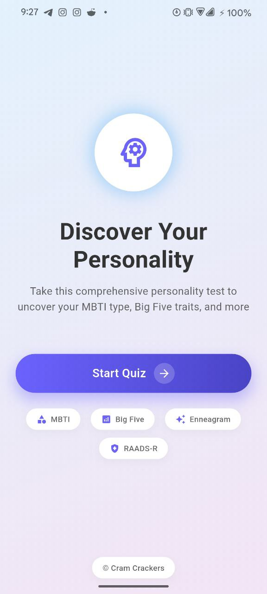
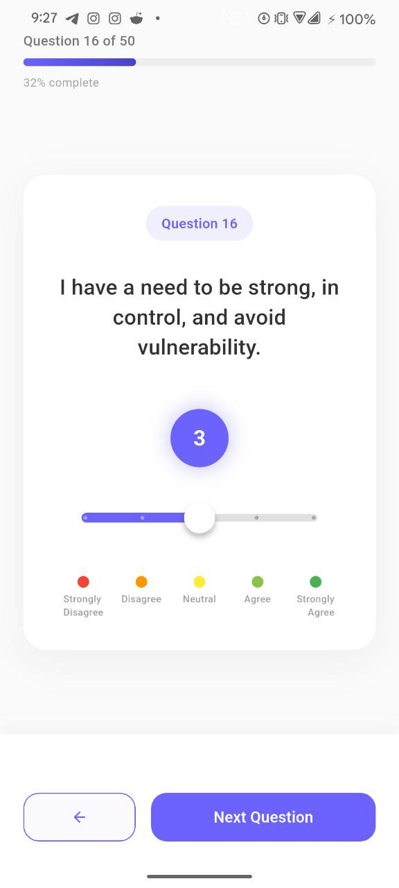
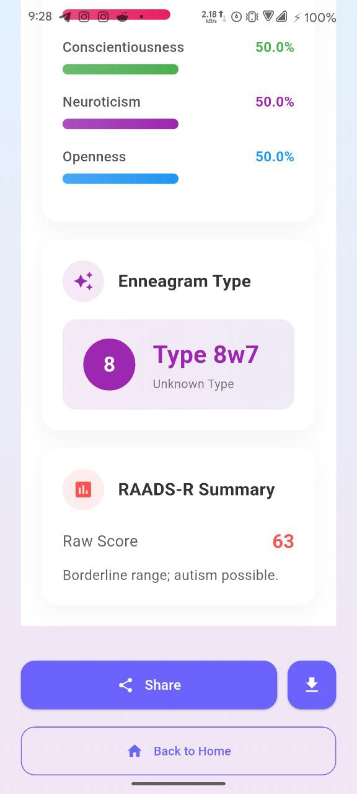

<div align="center">

# 🧠 Personality Detector
### A specific, scalable, and scientific personality analysis tool.


</div>

---

## 📌 Overview

**Personality Detector** is a questionnaire-based mobile application that helps users understand their personality traits through scientifically recognized models. The app collects user answers, processes them using structured scoring logic, and presents clear, interpretable personality results.

The project is designed with **Clean Architecture** principles, making it easy to scale, test, and maintain.

---

## 📸 Screenshots

| Start Screen | Questionnaire | Results |
|:---:|:---:|:---:|
|  |  |  |

> **Note**: More screenshots available in `assets/screenshots/`.

---

## 🧪 Personality Models Supported

- **MBTI** (Myers–Briggs Type Indicator)
- **Enneagram**
- **Big Five Personality Traits**
- **RAADS-R** (Autism Spectrum Screening)

---

## ✨ Features

- 🔄 **Multi-step questionnaire flow** with intuitive UI.
- 📊 **Dynamic scoring** and result calculation in real-time.
- 📑 **Clear and readable personality reports**.
- 🏗 **Clean Architecture**: Separation of UI, business logic, and data layers (`MVVM` + `Bloc`).
- 🧪 **Test-friendly**: Designed for high test coverage.
- 🧩 **Modular Components**: Reusable Flutter widgets.

---

## 🏗 Architecture

The project follows **Clean Architecture** combined with **MVVM**. Each layer has a clear responsibility:

1. **Presentation Layer** — UI, Widgets, State Management (Bloc/Cubit)
2. **Domain Layer** — Business logic, Use Cases, Entities
3. **Data Layer** — Models, Repositories, Data Sources

This approach ensures **Low coupling**, **High testability**, and **Ease of maintenance**.

---

## 🛠 Tech Stack

- **Flutter** — Cross-platform UI framework
- **Dart** — Programming language
- **Bloc / Cubit** — State management
- **Equitable** — Value equality
- **Json Serialization** — Data structure management

---

## 🚀 Getting Started

### Prerequisites
- [Flutter SDK](https://flutter.dev/docs/get-started/install)
- [Dart SDK](https://dart.dev/get-dart)
- Android Studio / VS Code

### Installation

1. **Clone the repository**:
   ```bash
   git clone https://github.com/MahirUddinn/personality_detector.git
   cd personality_detector
   ```

2. **Install dependencies**:
   ```bash
   flutter pub get
   ```

3. **Generate code** (for JSON serialization):
   ```bash
   dart run build_runner build --delete-conflicting-outputs
   ```

4. **Run the app**:
   ```bash
   flutter run
   ```

---

## 📈 Future Improvements

- [ ] Persistent user profiles (Local/Cloud)
- [ ] Cloud-based result storage (Firebase)
- [ ] Data visualization (Charts & Graphs)
- [ ] Localization (Multi-language support)
- [ ] AI-based personality insight summaries

---

## 👤 Author

**Mahir Uddin**
- GitHub: [@MahirUddinn](https://github.com/MahirUddinn)
- LinkedIn: [Mahir Uddin](https://www.linkedin.com/in/mahir-uddin)
